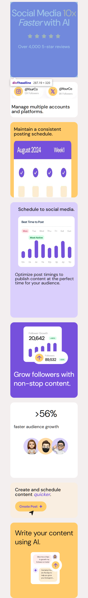
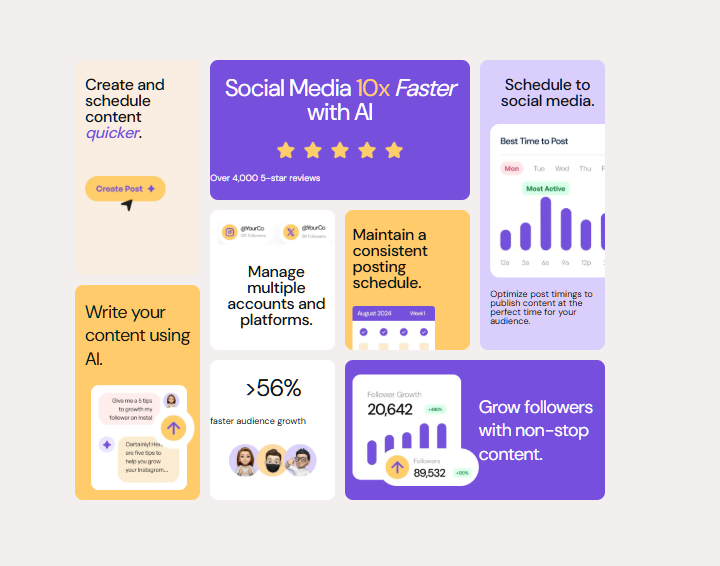

# Bento Grid Main

This is a solution to the [Bento Grid challenge on Frontend Mentor](https://www.frontendmentor.io/challenges/bento-grid-RMydElrlOj). Frontend Mentor challenges help you improve your coding skills by building realistic projects.

## Table of Contents

- [Overview](#overview)
  - [The Challenge](#the-challenge)
  - [Screenshot](#screenshot)
  - [Links](#links)
- [My Process](#my-process)
  - [Built With](#built-with)
  - [What I Learned](#what-i-learned)
  - [Continued Development](#continued-development)
  - [Useful Resources](#useful-resources)
- [Author](#author)
- [Acknowledgments](#acknowledgments)

## Overview

### The Challenge

Users should be able to:

- View the optimal layout for the interface depending on their device's screen size.
- Interact with grid-based components seamlessly.

### Screenshot


#### mobile_view


#### desktop_view


### Summary

The **Bento Grid Main** project focuses on creating a responsive and visually appealing grid-based layout. This project uses CSS Grid and Flexbox to ensure proper alignment and responsiveness. The challenge was to replicate a realistic and user-friendly grid design while maintaining accessibility and adaptability across various screen sizes.

### Links

- Solution URL: [solution URL here](https://github.com/ezekiel673/bento-grid-main)
- Live Site URL: [live site URL here](https://ezekiel673.github.io/bento-grid-main/)

## My Process

### Built With

- React
- CSS custom properties
- Flexbox
- CSS Grid
- Mobile-first workflow

### What I Learned

While working on this project, I deepened my understanding of CSS Grid and responsive design principles. Here’s an example of a grid layout I implemented:

```css
.grid-container {
  display: grid;
  grid-template-columns: repeat(auto-fit, minmax(200px, 1fr));
  gap: 1.5rem;
}
```
- This approach ensures a flexible layout that adjusts seamlessly based on the screen size.

## Continued Development
I aim to:

- Further refine my skills in creating complex grid-based layouts.
- Experiment with advanced CSS animations to make interfaces more interactive.
- Improve accessibility by incorporating ARIA roles and testing with screen readers.

## Useful Resources
- [Learn CSS Grid](https://learncssgrid.com/) - This comprehensive guide helped me understand and apply grid properties effectively.
Responsive Design - A great resource for mastering responsive layouts.
## Author

- [LinkedIn](https://ng.linkedin.com/in/ezekiel-adeosun) - @ezekiel-adeosun  
- [Frontend Mentor](https://www.frontendmentor.io/profile/ezekiel673) - @ezekiel673  
- [Twitter](https://xg.com/yeshua_codeit) - @yeshua_codeit

## Acknowledgments


